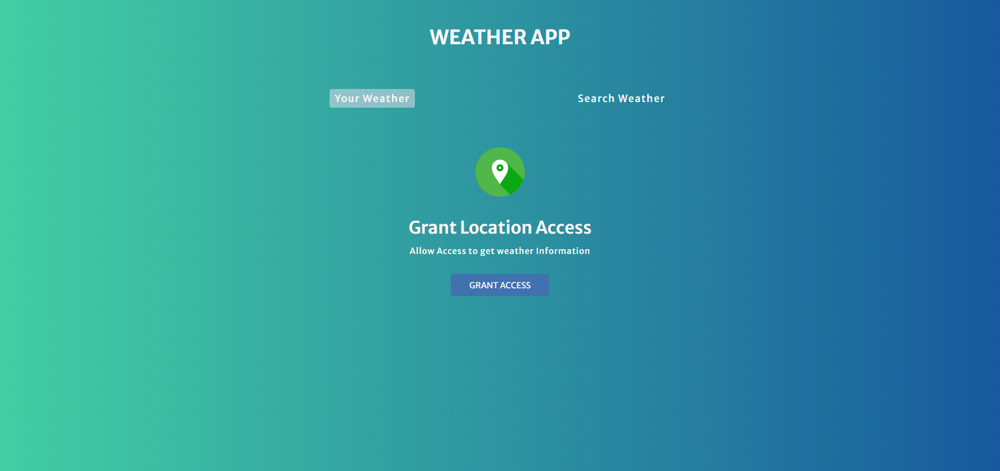
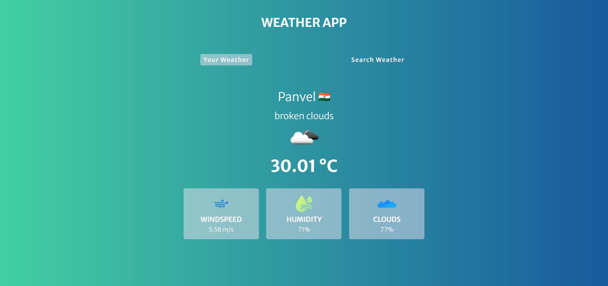

# Weather-App 

Created this weather app using HTML, CSS and JS.

## Demo Link
[Link](https://psargar616.github.io/Weather-App-2.0/)

## New Learnings 
- Integrating weather API with project
- Fetching values from weather API and display it UI elements
- Using 'Navigator: geolocation' property to find lantitude and longitude of current location
- Reusing same class to style different elements
- Using 'Window: sessionStorage property'
- using 'async' and 'await' in functions responsible for fetching API response
- Adding tab swithching functionality using JS 
- Hiding and displaying the required tabs based on user's choise 
- Using try and catch blocks for error handling
- Using template literals 
- Using 'Optional Chaining operator' to access nested properties and methods of an object
